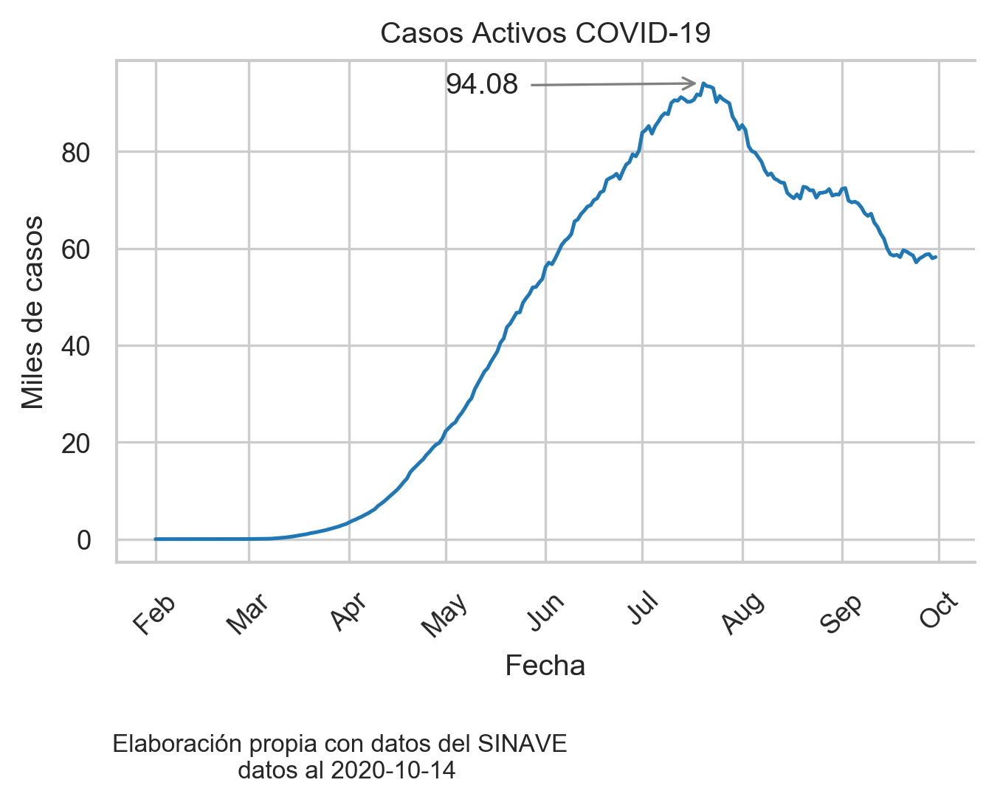
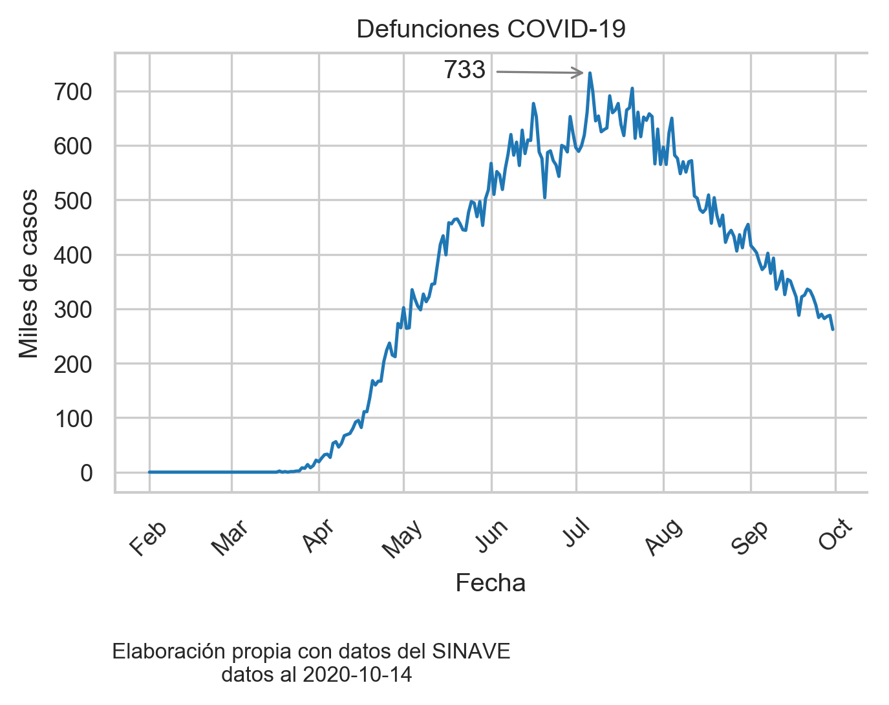

# Gráficas de Casos Activos y Defunciones

Este código genera las gráficas de Casos Activos y de Defunciones por Covid-19 a nivel nacional usando la base de datos del [Sistema Nacional de Vigilancia Epidemiológica (SINAVE)](https://www.gob.mx/salud/acciones-y-programas/sistema-nacional-de-vigilancia-epidemiologica). Se usa como ejemplo la base del 14 de octubre.

### Las gráficas que se generan son las siguientes:

Casos Activos

Defunciones
 